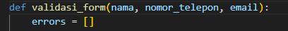
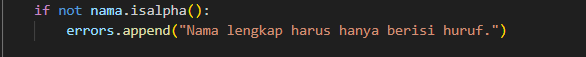
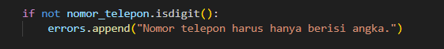
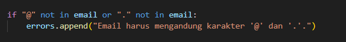
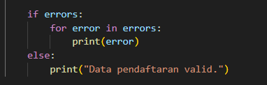
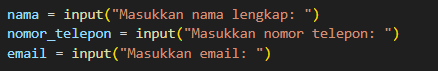
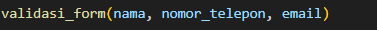
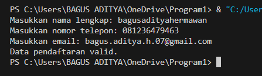
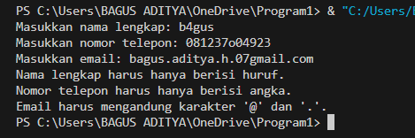

# Studi kasus: Validasi Form Input
## Kode program dan langkah-langkahnya

### Langkah 1
langkah pertama validasi_form untuk menerima tiga yakni nama, nomer_telepon, dan email. membuat variabel error supaya kalau ada kesalahan dapat ditampung:

### Langkah 2
Membuat fungsi isalpha() untuk memeriksa semua karakter dalam string nama agar memastikan hanya hururf saja. jika ada kesalahan ditambahkan ke daftar error:

### Langkah 3
Fungsi isdigit() untuk memeriksa karakter dalam string adalah angka. jika mengandung karakter selain angka akan ditambahkan ke daftar error:

### Langkah 4
if validasi sederhana memeriksa string email mengandung karakter "@" dan ".". jika tidak ada akan ditambahkan ke daftar error:

### Langkah 5
menampilkan hasil validasi. if error, jika ada error pesan kesalahan akan dicetak. jika tidak pesan "Data pendaftaran vakid":

### Langkah 6
program meminta input dari pengguna yakni nama, nomor_telepon, dan email:

### Langkah 7
validasi_form untuk memproses data dan memberikan umpan balik sesuai validasi:

### hasil eksekusi

jika error:
